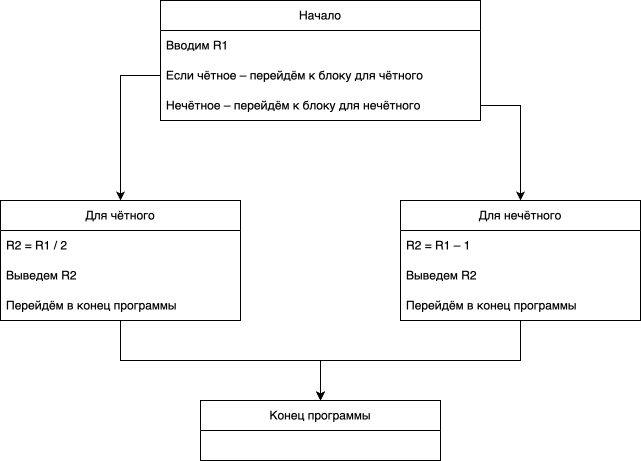
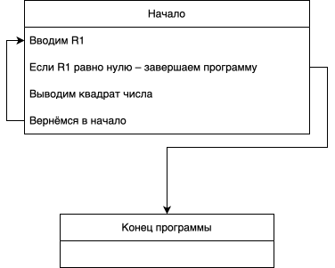

# ZVM (Zhelezyaka Virtual Machine)

**Железяка**, или **ЖВМ** — Железячная Вычислительная Машина.

## Установка

```bash
git clone git@github.com:/SilverFoxxxy/zvm
cd tinyvm
./install.sh
```

```sh
g++ -std=c++17 -O2 -o zvm zvm.cpp
```

```sh
zvm hello.zasm
```

## Модель

Три важных понятия:

- **Программа** — упорядоченный список инструкций. У каждой инструкции
  есть позиция (номер строки в файле). Программа исполняется сверху
  вниз, начиная с первой инструкции.
- **Регистры** — 16 ячеек `R0..R15` внутри процессора. Каждая хранит
  одно целое число. В начале все равны `0`.
- **ALU** (арифметико-логическое устройство) — то, что выполняет
  арифметику, логику и сравнения. ALU берёт значения из регистров
  (или из констант прямо в инструкции) и кладёт результат
  в регистр, указанный для записи.

Инструкция — это команда, исполняемая за один шаг. После выполнения инструкции машина переходит
к следующей. Единственное, что может изменить этот порядок, — команды
перехода.

Памяти у нас пока нет: все данные живут в 16 регистрах.

## Синтаксис

- **Комментарий** — от `;` до конца строки.
- **Пустая строка** — игнорируется.
- **Регистр** — `Rx`, где `x` это число от 0 до 15: `R0`, `R7`, `R15`.
- **Число** — целое, со знаком или без: `0`, `42`, `-1`.
- **Стрелка** `->` отделяет **источники** от **приёмника**.
  Читается «записываем в»: `ADD R1, R2 -> R3` — «складываем R1 и R2, сумму записываем в R3».
- **Метка** — имя из букв, цифр и `_`, не совпадающее с командой
  или регистром.

## Список инструкций

```
; ввод-вывод
READ  -> Rx           ; читать число со входа в Rx
WRITE Rx              ; печатать число из Rx
WRITE NL              ; печатать перевод строки

; пересылка
MOV   X -> Ry         ; Ry = X

; арифметика
ADD   X, Y -> Rz      ; Rz = X + Y
SUB   X, Y -> Rz      ; Rz = X - Y
MUL   X, Y -> Rz      ; Rz = X * Y
DIV   X, Y -> Rz      ; Rz = X / Y   (целочисленное деление)
MOD   X, Y -> Rz      ; Rz = X % Y   (остаток от деления)

; сравнения — результат 0 или 1
EQ    X, Y -> Rz      ; Rz = 1, если X равно Y, иначе 0
NE    X, Y -> Rz      ; Rz = 1, если X не равно Y, иначе 0
LT    X, Y -> Rz      ; Rz = 1, если X меньше Y, иначе 0
GT    X, Y -> Rz      ; Rz = 1, если X больше Y, иначе 0
LE    X, Y -> Rz      ; Rz = 1, если X не больше Y, иначе 0
GE    X, Y -> Rz      ; Rz = 1, если X не меньше Y, иначе 0

; управление порядком
MARK  name            ; отметить позицию в программе
JUMP  name            ; переходим к метке с именем name
JUMPIF Rx, name       ; переходим к метке, если Rx != 0 (Rx не равен нулю)
```

`X` и `Y` — регистр или число. `Rz` — всегда регистр.
`NL` — константа, используется только для `WRITE`.

## Ввод-вывод

`READ -> Rx` читает одно целое число со входа и кладёт в `Rx`.
`WRITE Rx` печатает число из `Rx`. Если в текущей строке уже
что-то печаталось, перед числом ставится пробел. `WRITE NL`
печатает перевод строки и сбрасывает этот счётчик.

```asm
READ -> R0
READ -> R1
WRITE R0            ; первое число в строке
WRITE R1            ; второе, через пробел
WRITE NL            ; перевод строки
```

## Присваивание

`MOV X -> Ry` присваивает `Ry` значение `X`. `X` может быть
регистром или числом.

```asm
MOV R0 -> R1        ; R1 = R0
MOV 5  -> R2        ; R2 = 5
MOV 0  -> R0        ; обнулить R0
```

## Арифметика

Все арифметические команды берут два источника `X` и `Y` (регистры
или числа) и кладут результат в приёмник `Rz`. Источники не
изменяются.

`ADD X, Y -> Rz` — сложение.

```asm
ADD R1, R2 -> R3    ; R3 = R1 + R2
ADD R1, 1  -> R1    ; R1 = R1 + 1, счётчик
```

`SUB X, Y -> Rz` — вычитание.

```asm
SUB R1, R2 -> R3    ; R3 = R1 - R2
SUB 0,  R1 -> R2    ; R2 = -R1
```

`MUL X, Y -> Rz` — умножение.

```asm
MUL R1, R2 -> R3    ; R3 = R1 * R2
MUL R1, R1 -> R2    ; R2 = R1 * R1, квадрат
```

`DIV X, Y -> Rz` — целочисленное деление.

```asm
DIV R1, 10 -> R2    ; R2 = R1 / 10
```

`MOD X, Y -> Rz` — остаток от деления.

```asm
MOD R1, 10 -> R2    ; R2 = R1 % 10
```

Деление и остаток на ноль — ошибка исполнения.

## Сравнения

Сравнения работают так же, как арифметика: берут два источника,
кладут результат в приёмник. Результат — всегда `0` или `1`.
Это обычное число, его можно использовать где угодно.

Названия команд — сокращения английских слов: `equal` (равно),
`not equal` (не равно), `less than` (меньше), `greater than`
(больше), `less or equal` (не больше), `greater or equal`
(не меньше).

`EQ X, Y -> Rz` — равно (`equal`). Проверяем, равны ли `X` и `Y`.

```asm
EQ R0, R1 -> R2     ; R2 = 1, если R0 равно R1, иначе 0
EQ R0, 5  -> R2     ; R2 = 1, если R0 равно 5, иначе 0
```

`NE X, Y -> Rz` — не равно (`not equal`). Проверяем, различаются
ли `X` и `Y`.

```asm
NE R0, R1 -> R2     ; R2 = 1, если R0 не равно R1, иначе 0
NE R0, 0  -> R2     ; R2 = 1, если R0 не равно 0, иначе 0
```

`LT X, Y -> Rz` — меньше (`less than`). Проверяем, меньше ли `X`,
чем `Y`.

```asm
LT R0, R1 -> R2     ; R2 = 1, если R0 меньше R1, иначе 0
LT R0, 0  -> R2     ; R2 = 1, если R0 отрицательно, иначе 0
```

`GT X, Y -> Rz` — больше (`greater than`). Проверяем, больше ли
`X`, чем `Y`.

```asm
GT R0, R1 -> R2     ; R2 = 1, если R0 больше R1, иначе 0
GT R0, 100 -> R2    ; R2 = 1, если R0 больше 100, иначе 0
```

`LE X, Y -> Rz` — не больше (`less or equal`). Проверяем, что
`X` не больше `Y`, то есть `X` меньше или равен `Y`.

```asm
LE R0, R1 -> R2     ; R2 = 1, если R0 не больше R1, иначе 0
LE R0, 10 -> R2     ; R2 = 1, если R0 не больше 10, иначе 0
```

`GE X, Y -> Rz` — не меньше (`greater or equal`). Проверяем,
что `X` не меньше `Y`, то есть `X` больше или равен `Y`.

```asm
GE R0, R1 -> R2     ; R2 = 1, если R0 не меньше R1, иначе 0
GE R1, R0 -> R2     ; R2 = 1, когда R1 это хотя бы R0
```

## Управление порядком исполнения

`MARK name` отмечает текущую позицию в программе. К этой метке затем можно перейти.

```asm
MARK LOOP
```

`JUMP name` — безусловный переход к метке.

```asm
JUMP LOOP
```

`JUMPIF Rx, name` — переход, если `Rx != 0`.

```asm
JUMPIF R1, DONE
```

`JUMPIF` проверяет, что значение не равно нулю. Значения `2`, `-1`, `100` — истина. `0` — ложь.

### Пример – проверка на чётность

Задача – вводится число. Если оно чётное – выведите результат его деления на два. Если оно нечётное – вычтите из него единицу и выведите результат.

**Схема**



**Код**

```asm
; начало программы
READ -> R1
MOD R1, 2 -> R2
EQ R2, 0 -> R3
JUMPIF R3 EVEN ; если чётное – прыгаем к блоку для чётного
JUMP ODD ; иначе прыгаем к блоку для нечётного

; блок для чётного
MARK EVEN
DIV R1, 2 -> R4
WRITE R4
WRITE NL
JUMP END

; блок для нечётного
MARK ODD
SUB R1, 1 -> R4
WRITE R4
WRITE NL
JUMP END

; конец программы
MARK END
```

### Пример – квадраты

Нам вводится число – выводим его квадрат.
Повторяем, пока нам не введут ноль.

**Схема**



**Код**

```asm
MARK START
READ -> R1
    EQ R1 0 -> R3
    JUMPIF R3 END
MUL R1, R1 -> R2
WRITE R2
WRITE NL
JUMP START

MARK END
```
